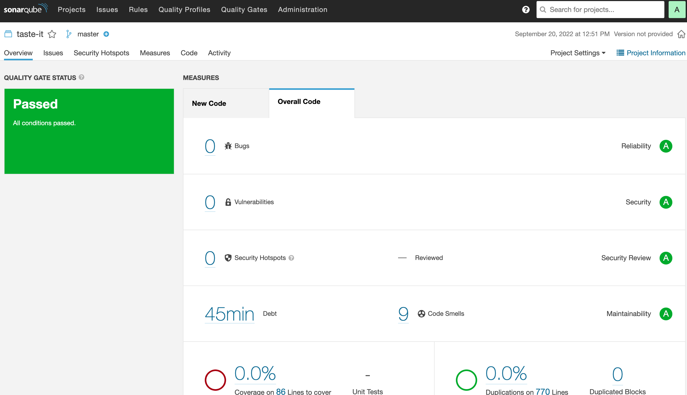

# Recipe App

An app to browse cooking recipes and also create and save your own. This is a school project during fullstack studies at Business College Helsinki.


## Installation

To run the app in your local machine , run the following commands:

- install all dependencies:

```
npm install
npm install react-router-dom@6
npm start
```

- to run database:

```
npm install axios
npm install json-server --save-dev
npm run server (server will run at http://localhost:3001/recipes)
```

## Built with

- HTML
- CSS / CSS modules
- ReactJS
- Flexbox
- Grid
- React Router
- Responsive Design

## Resource links

How to Pass Props Through React Router's Link Component:
https://ui.dev/react-router-pass-props-to-lin

## What I learned

- create a new branch with git:

```
git checkout -b my-branch
```

- switch between branch (my-branch and master), get out of my-branch and go to master branch:

```
git checkout master
```

Screenshot of code analysis


